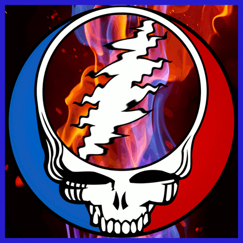

# syf-plymouth splash screen
- This displays a looped set of six Grateful Dead Steal Your Face images with a transparent inner circle showing a waving bolt and background fire pattern.
- The images are by Steve Konklin, see https://giphy.com/gifs/3o85xuUgH5oHsk4Lss for this animation or https://giphy.com/skonklin for more animations.
- The plymouth script was adapted from Aditya Shakya (https://github.com/adi1090).
- the `test` script will display the actual plymouth output so you can tweak the variables as needed.

  

